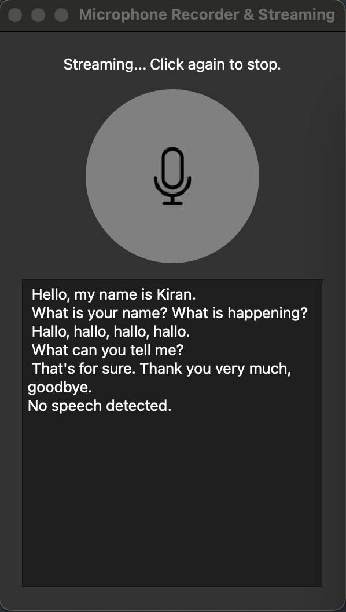

# TransApp
Hacked together `openai-whisper` and `deepl` translation to stream and live transcribe-translate languages during meetings to any supported whisper/deepl languages.

The inspiration came from my struggle to understand some colleagues with a thick german/swiss german accent during meetings. This tool will hopefully help me follow along!

<p align="center">
  
</p>


## To do:
- [ ] Create Android APK package for smartphone
- [ ] Troubleshoot PyInstaller for MacOS dist (App is not performing as expected)
- [ ] Add App buttons for transcription source language and translation target language

## Features

- The App uses `openai-whisper` and `deepl` API to live transcribe and translate speech.
- Currently, the `whisper` model is hosted on a GPU server.
- Speech is recorded through the microphone and sent as WAV through WebSocket to `/transcription` API endpoint.
- Transcribed text is translated with `deepl` API to english.
- Translated text is streamed back to App.
 
## Setup

- Clone the repository:
```bash
git clone git@github.com:K-Schubert/TransApp.git
cd TransApp
```

- Set deepl API key:
```bash
nano .env
# Set DEEPL_API_KEY=<DEEPL_API_KEY>
```

- Create venv:
```bash
# NOTE: Requires python < python3.13
python3.11 -m venv venv_transapp
source venv_transapp/bin/activate
```

- Install requirements:
```bash
pip install -r requirements.txt
```

- Run app and server with CLI:
```bash
# Run server
python3 whisper_server_stream.py
```

```bash
# Run app
python3 translate_app_stream.py
```

- OR build executable for MacOS:
```bash
# Build app
pyinstaller TransApp.spec
# Run app from dist folder
```
